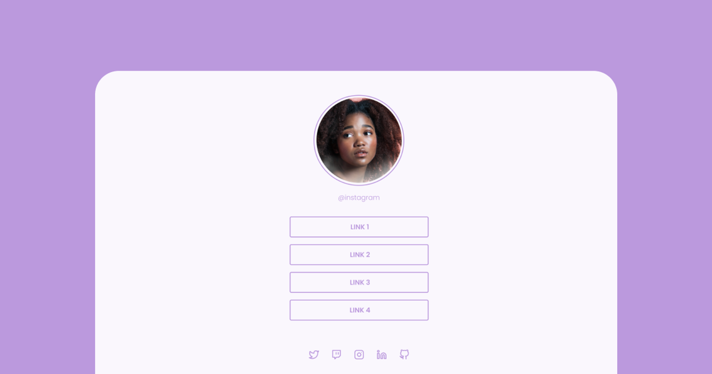

 <h1 align="center"> Desafio 3 da aula da Rocketseat </h1>

Terceiro exercicio de aprendizagem HTML/CSS com a equipe da Rocketseat.

  <a href="#-tecnologias">Tecnologias</a>&nbsp;&nbsp;&nbsp;|&nbsp;&nbsp;&nbsp;
  <a href="#-projeto">Projeto</a>&nbsp;&nbsp;&nbsp;|&nbsp;&nbsp;&nbsp;
  <a href="#memo-licença">Licença</a>

  

 

  

## 🚀 Tecnologias

Esse projeto foi desenvolvido com as seguintes tecnologias:

- HTML
- Git e Github
- CSS

## 💻 Projeto

Exercicio de fixaçao do curso do HTML/CSS da Rocketseat

## :memo: Licença

Esse projeto está sob a licença MIT.

---

Feito com ♥ by Angelo Jr :wave:

